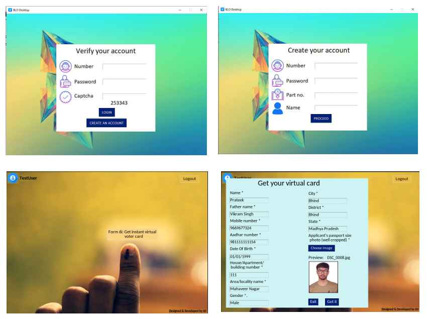
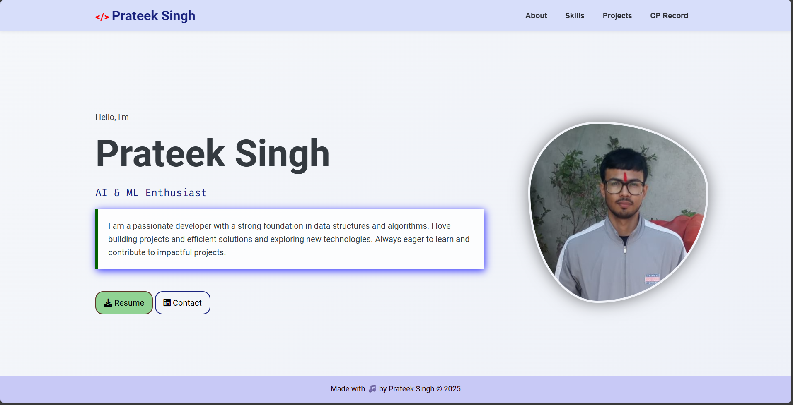

  

# Hi👋, I'm Prateek Singh 

  

Welcome to my GitHub portfolio! I am a first year B.Tech student in **Artificial Intelligence**, currently pursuing my graduation from Madhav Institute of Technology and Science, Gwalior.

I enjoy building applications that solve real-world problems, and continually learning new technologies.

---

### 👨‍💻 What I have done:

- **GUI Windows Application**: Developed windows application utilizing **Python(tKinter)** for frontend and **MySQL** for the database.
- **Database Management**: Experience with SQL databases, including **MySQL** facilitating effective data management.
- **Frontend Technologies**: Skilled in creating responsive user interfaces with **HTML5**, **CSS3**.
- **Data Analysis & Visualization**: Proficient in data analysis and visualization using **Numpy**, **Matplotlib**.
- **Version Control**: Utilization of **Git** and **GitHub** for effective version control and collaboration.

### 🌱 What I am doing:

- I am practicing DSA in JAVA right now.
- Working on building projects and hackathons.

### 🚀 What I will do:

- Continue solving questions daily atleast one on leetcode for consistency.
- Invest my time in learning to build AI & ML projects.
- Explore web technologies and enhance my skills in web development.

---

# 📊 GitHub Stats:
 
 

## 🔗 Contact and Social Media:

  
  
  
  

---

## 🛠️ Skills:

### Languages:

  
  
  
  

### Technologies & Tools:

---

## 📂 Projects:

<table style="padding: 20px; border-spacing: 30px;">
  <tr>
  <td align="center" width="50%" style="padding: 20px;">
      

         
        <strong>Virtual Voter Card Making System</strong> 
        
Technologies: tKinter (Python) & MySQL

        
      

    </td>
    <td align="center" width="50%" style="padding: 20px;">
      

         
        <strong>Personal Portfolio</strong> 
        
Technologies: HTML & CSS

        
      

    </td>
</tr>
</table>

---

## 🎓 Certificates:

- [JAVA basics - Hackerrank](https://www.hackerrank.com/certificates/iframe/7f4f47533df9)
- [AI for beginners - HP Life](https://www.life-global.org/certificate/6e997696-934a-43a7-bfb5-2f7c520f8bf8)
- [Introduction to Machine learning](https://learn.microsoft.com/en-us/users/PrateekSingh-7290/achievements/QSY89DHE)

---

